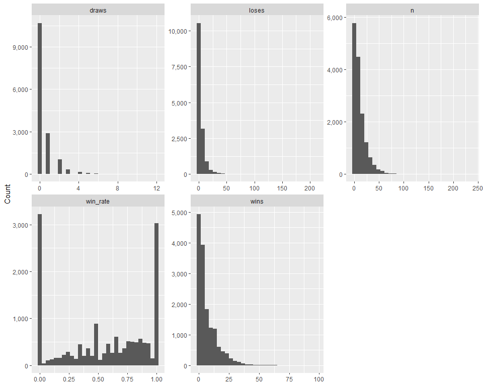
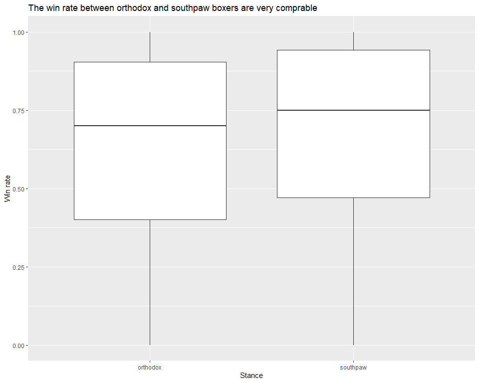
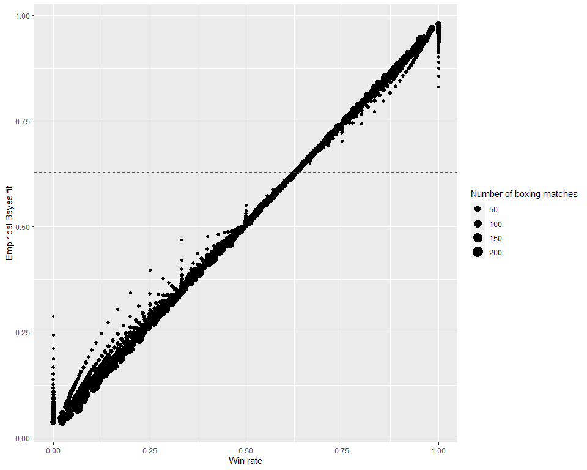
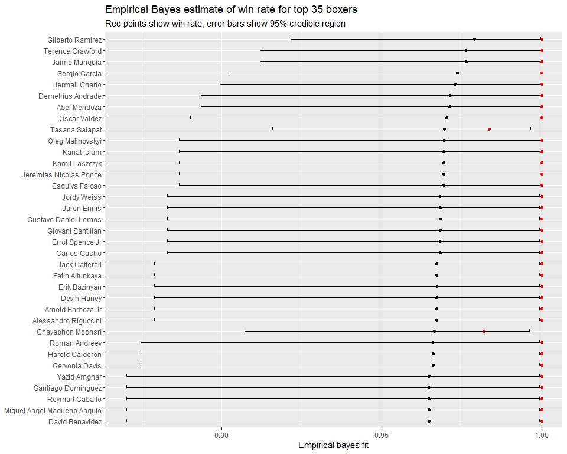
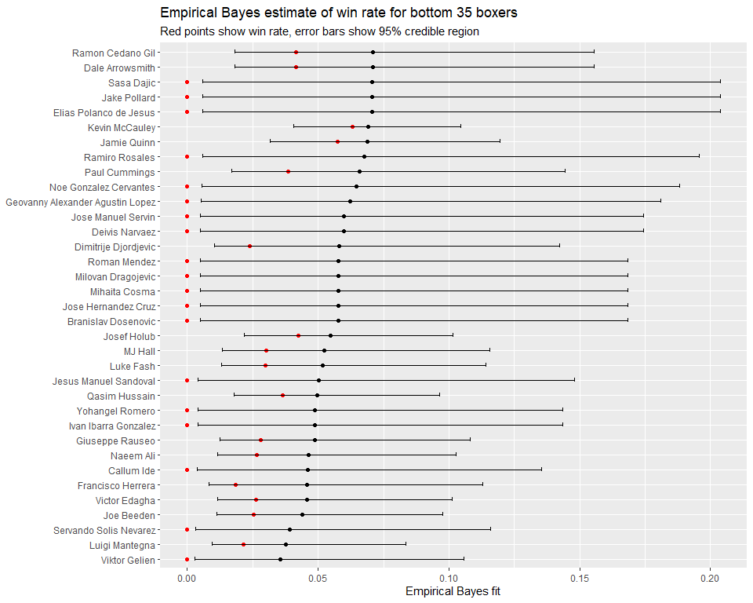
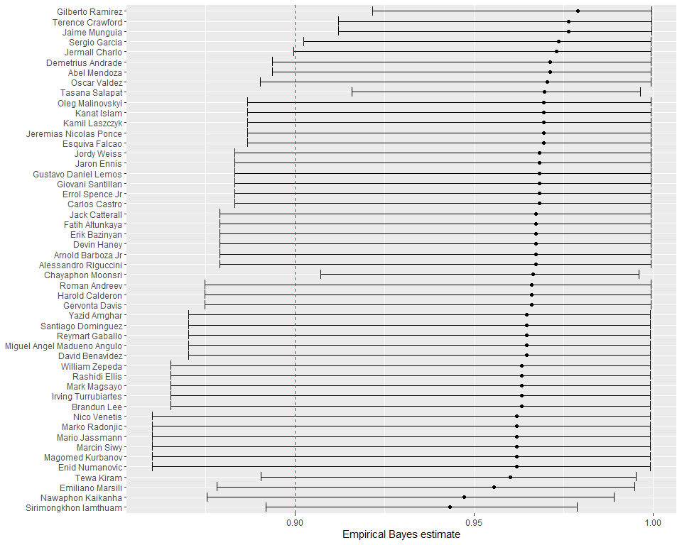

### Estimate boxer win rates using Empirical Bayes

    library(tidyverse)
    # devtools::install_github("dgrtwo/ebbr")
    library(ebbr)

### Load scraped boxer ratings from boxrec.com

The code to scrape the boxer ratings with wins, loses, and draws is in
boxrec\_scraping.Rmd

    boxing <- read_csv("data/boxing_ratings.csv")

    boxing <- boxing %>%
        mutate(name = str_remove_all(name, "\\*"),
               name = str_squish(name))

 

### How are number of fights, wins, loses, draws, and win rate distributed?

    boxing %>%
        select(n, wins, loses, draws, win_rate) %>%
        pivot_longer(cols = everything()) %>% 
        drop_na() %>%
        ggplot(aes(value)) +
        geom_histogram() +
        facet_wrap(~name, scales = "free") +
        labs(x = NULL,
             y = "Count") +
        scale_y_continuous(labels = scales::comma_format())

 

### Do orthodox boxers have a higher win rate than southpaw boxers?

    boxing %>%
        drop_na() %>%
        ggplot(aes(stance, win_rate)) +
        geom_boxplot() +
        labs(x = "Stance",
             y = "Win rate",
             title = "The win rate between orthodox and southpaw boxers are very comprable")

 

### Who are the best boxers (i.e., those with the highest win rates)?

There are boxers who have won 100% of their boxing matches, yet they may
have only boxed a small number of matches. I’ll use empirical Bayesian
techniques to better estimate the win rates of these 15k+ boxers.

    prior <- boxing %>%
        drop_na(wins, n) %>%
        filter(n > 10) %>%
        ebb_fit_prior(wins, n)

    prior

    ## Empirical Bayes binomial fit with method mle 
    ## Parameters:
    ## # A tibble: 1 x 2
    ##   alpha  beta
    ##   <dbl> <dbl>
    ## 1  1.59 0.937

    boxing_augment <- boxing %>%
        drop_na(wins, n) %>%
        filter(n > 2) %>%
        add_ebb_estimate(wins, n, prior_subset = n > 10)

    boxing_augment %>%
        ggplot(aes(win_rate, .fitted, size = n)) +
        geom_point() +
        geom_hline(yintercept = tidy(prior)$mean, color = "red", lty = 2) +
        labs(x = "Win rate",
             y = "Empirical Bayes fit",
             size = "Number of boxing matches")

The plot above shows how each boxer’s win rate plotted against the
empirical Bayes estimate. The size of each point represents how many
boxing matches the boxer has had. The Bayesian estimate for boxer’s with
very low or very high win rates are shifted towards the average win rate
(the dotted red line), unless the number of boxing matches they have had
is large enough. The most drastic differences between the raw win rate
and the empirical Bayesian approach is for those boxers who have very
low win rates.

 

    library(glue)

    top_n <- 35

    boxing_augment %>%
        slice_max(.fitted, n = top_n) %>%
        mutate(name = fct_reorder(name, .fitted)) %>%
        ggplot(aes(.fitted, name)) +
        geom_point() +
        geom_point(aes(x = win_rate), color = "red") +
        geom_errorbar(aes(xmin = .low, xmax = .high), width = 0.25) +
        labs(x = "Empirical bayes fit",
             y = NULL,
             title = glue("Empirical Bayes estimate of win rate for top {top_n} boxers"),
             subtitle = "Red points show win rate, error bars show 95% credible region")

The plot above shows the empirical Bayes estimate along with the 95%
credible region for the top 35 boxers. The red dots show the boxer’s win
rate. The plot shows that most of the top boxer’s based on the empirical
Bayes estimate are currently undefeated. However, this analysis shows a
true win rate of 100% is unlikely. Note: this analysis is only for
active professional boxers, hence, no Floyd Mayweather who has a 100%
win rate over 50 matches.

The plot below shows the same idea but for the 35 boxers with the lowest
win rate estimate.

    boxing_augment %>%
        slice_min(.fitted, n = top_n) %>%
        mutate(name = fct_reorder(name, .fitted)) %>%
        ggplot(aes(.fitted, name)) +
        geom_point() +
        geom_point(aes(x = win_rate), color = "red") +
        geom_errorbar(aes(xmin = .low, xmax = .high), width = 0.25) +
        labs(x = "Empirical Bayes fit",
             y = NULL,
             title = glue("Empirical Bayes estimate of win rate for bottom {top_n} boxers"),
             subtitle = "Red points show win rate, error bars show 95% credible region")

 

### Which boxers have estimated win rates gerater than 90%?

To determine which boxers win rate estimate are greater than 90%, I will
compute the posterior error probability for each boxer. Using an alpha
of 0.05, I can be 95% confident that the boxers included below have a
true win rate of 90%.

    test_prop <- 0.90

    boxing_augment %>%
        add_ebb_prop_test(test_prop, alternative = "greater", sort = TRUE) %>%
        filter(.qvalue < 0.05) %>%
        mutate(name = fct_reorder(name, .fitted)) %>%
        ggplot(aes(.fitted, name)) +
        geom_point() +
        geom_errorbar(aes(xmin = .low, xmax = .high)) +
        geom_vline(xintercept = test_prop, color = "red", lty = 2) +
        labs(x = "Empirical Bayes estimate",
             y = NULL)

Out of 15,200 boxers in the dataset, only 50 boxers have an estimated
win rate of 90+%, compared to the 3,788 boxers that have raw win rates
of 90+%. By using empirical Bayes we can get a less biased and more
informative estimate of boxer’s win rates (especially those who have had
few matches).

           
